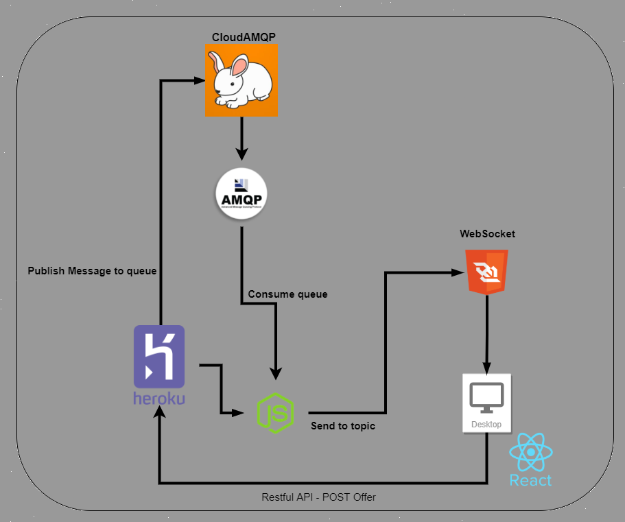

# Corretora da bolsa de valores com RabbitMQ

**Andrew Costa Silva, andrew.costa@sga.pucminas.br**

**João Guilherme Martins Borborema, jborborema@sga.pucminas.br**

---

Curso de Engenharia de Software, Unidade Praça da Liberdade

_Instituto de Informática e Ciências Exatas – Pontifícia Universidade de Minas Gerais (PUC MINAS), Belo Horizonte – MG – Brasil_

---

_**Resumo**. Escrever aqui o resumo. O resumo deve contextualizar rapidamente o trabalho, descrever seu objetivo e, ao final, 
mostrar algum resultado relevante do trabalho (até 10 linhas). no qual poderá ser acessado através desse link - https://bovespa-rabbitmq-bovespa-rabbitmq-andrewcs0901-joaoguimb.vercel.app/_

---

**1. Introdução**

Este trabalho está inserido em um contexto de mercado financeiro no qual uma bolsa de valores central e corretoras realizam ofertas, transações e assinam em determinados tópicos de ativos.

Além disso,  no enfoque ao desenvolvimento de sistemas distribuídos, segundo Colouris(2016) - "A comunicação indireta é definida como a comunicação entre entidades de um sistema distribuído por meio de um intermediário, sem nenhum acoplamento direto entre o remetente e o destinatário (ou destinatários)", devido à isso propoe-se o uso de um sistema de fila de mensagens que é bastante utilizado em  cenários de transações financeiras.

O objetivo deste trabalho é elaborar uma solução em tempo real para bolsa de valores utilizando um sistema de messageria, no qual é possível cadastrar ofertas, realizar transações e corretoras possam assinar tópicos de ativos.

São os objetivos específicos deste trabalho:

- Aplicar os conhecimentos obtidos na disciplina de Desenvolvimento de Sistemas Móveis e Distribuídos;

- Disponibilizar a execução da aplicação em um ambiente não *localhost*

- Ser possível executar a solução via navegador *web*.

Mostre também as **justificativas** para o 
desenvolvimento do seu trabalho e caso deseje, destaque alguma contribuição do trabalho.

    1.1 Contextualização
    1.2 Problema
    1.3 Objetivo geral
       1.3.1 Objetivos específicos
    1.4 Justificativas

**2. Projeto da Solução**

    2.1. Requisitos funcionais

| No.           | Descrição                       | Prioridade |
| ------------- |:-------------------------------:| ----------:|
| 01  | A corretora poderá assinar em determinado tópico | Alta  |
| 02 | A Bolsa de valores deverá registrar as ofertas |  Alta |
| 03 | A corretora poderá criar uma oferta de venda | Alta  |
| 04 | A corretora poderá criar uma oferta de compra| Alta |
| 05 | Quando uma oferta de compra for maior ou igual a uma oferta de venda, a bolsa de valores deverá registrar uma transação| Alta|
| 06 | Quando uma transação for registrada a bolsa de valores deve notificar as corretoras interessadas naquele ativo | Media | 

    2.2. Tecnologias

Para a realização deste trabalho foram utilizadas as seguintes tecnologias:

- **RabbitMQ**: Sistema de Mensageria *open source*  baseado na categoria de mensagens indiretas via fila de mensagens;
- **NodeJS**:  Ambiente de execução JavaScript q 
- **AMQP-TS**: Biblioteca de NodeJS que permite o uso da forte tipagem do TypeScript junto da simplificação da comunicação *Advanced Message Queuing Protocol*;
- **CloudAMQP**: Serviço em nuvem de publicação de mensagens;
- **ReactJS**: Biblioteca em JavaScript para o desenvolvimento de interfaces web reativas com o enfoque em reutilização de componentes ;
- **Express**:
- **WebSocket**:
- **Heroku**:

    2.3. Serviços inteligentes

Descreva o mecanismo de inteligência que será utilizado no seu sistema. Utilize a modelagem baseada em agente
para definir as entradas e saídas do seu módulo de serviço inteligente. Apresente quem irá fornecer o serviço
e em que módulo será utilizado.

	
**3. Modelagem de dados**

Apresente o modelo de dados. Defina o dicionário de dados com os respectivos formatos e significados.

    3.1. Diagrama de Entidade-Relacionamento

Apresente a estrutura das tabelas de banco de dados no modelo Diagrama de Entidade-Relacionamento.

**4. Sistema desenvolvido**

1. O usuário pode cadastrar uma oferta de compra preenchendo o formulário, informando o nome da corretora, nome da ação, quantide, preço e marcando a opção "Comprar", após isso será adicionado essa oferta na lista de compras

2. Da mesma forma, o usuário também pode cadastrar uma oferta de venda informando os mesmos campos e marcando a opção "Vender"

3. A transação ocorre quando há uma oferta de compra e venda com os mesmos valores por uma mesma ação, e é informado para todos os interessados naquela ação que o evento ocorreu

4. O usuário pode se cadastrar para receber atualizações de ofertas de compras, vendas e transações de uma determinada ação preenchendo o campo "Assinar ação"

**5. Avaliação**

O atual trabalho é apenas uma simulação de uma bolsa de valores, não sendo possível utilizar em um cenário real em produção. Entretanto, o sistema possui as funcionalidades em tempo real da bolsa de valores,como a possibilidade de o usuário cadastrar as ações em que ele tem interesse, cadastrar uma oferta de compra ou de venda e acompanhar as movimentações financeiras daqueles ativos que o cliente deseja acompanhar.

**6. Conclusão**

O presente trabalho demonstrou-se bastante desafiador por possuir novos métodos de comunicação entre serviços, mas foi um bom desafio para reforçar os conteúdos aprendidos em sala de aula. Além disso, a lógica da bolsa de valores foi bastante interessante de se desenvolver, para poder efetuar as transações entre os diversos clientes. 

