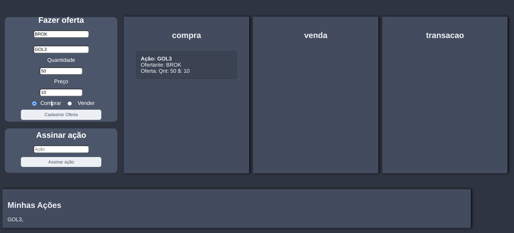
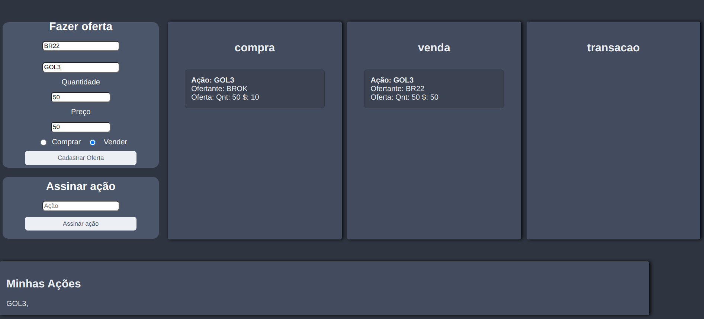
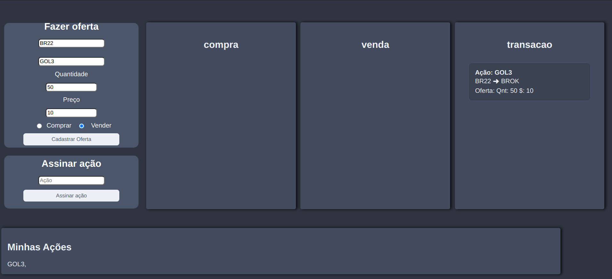
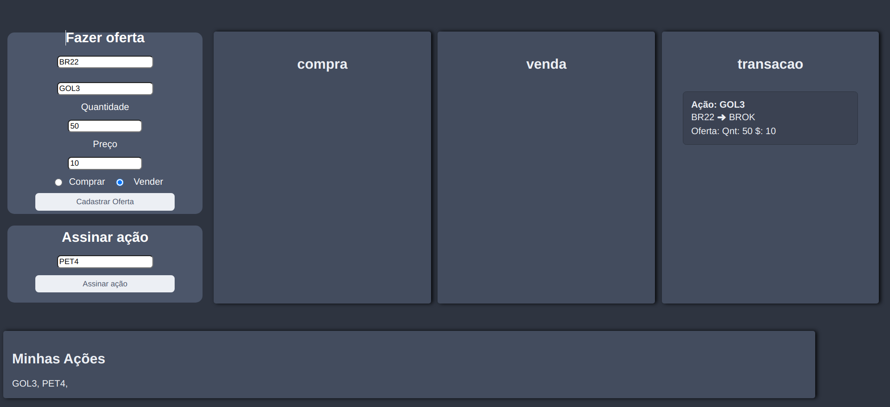

# Corretora da bolsa de valores com RabbitMQ

**Andrew Costa Silva, andrew.costa@sga.pucminas.br**

**João Guilherme Martins Borborema, jborborema@sga.pucminas.br**

---

Curso de Engenharia de Software, Unidade Praça da Liberdade

_Instituto de Informática e Ciências Exatas – Pontifícia Universidade de Minas Gerais (PUC MINAS), Belo Horizonte – MG – Brasil_

---

_**Resumo**. Escrever aqui o resumo. O resumo deve contextualizar rapidamente o trabalho, descrever seu objetivo e, ao final, 
mostrar algum resultado relevante do trabalho (até 10 linhas)._

---

**1. Introdução**

A introdução deve apresentar de dois ou quatro parágrafos de contextualização do trabalho. 

Este trabalho está inserido em um contexto de bolsa de valores, local onde é realizada a negociação de ações

Na **contextualização**, o aluno deve dizer do que se trata o trabalho, em que área ou contexto se insere. 
A **contextualização** deve ser desenvolvida de algo mais genérico para algo mais específico. 
A citação de pesquisas quantitativas é bem aceita aqui (corretamente referenciadas).

Em seguida o aluno deve caminhar a contextualização para descrever o **problema** que o artigo trata. 
O **problema** pode ser algo vivido em uma empresa específica.

O aluno deve escrever um pequeno parágrafo ou frase com o **objetivo geral** do trabalho. 
O objetivo deve ser bem direto, específico e definido com verbos de ação (elaborar, propor, ava-liar, comparar etc.).
Apresente também alguns (pelo menos 2) **objetivos específicos** dependendo de onde você vai querer concentrar a 
sua prática investigativa, ou como você vai aprofundar no seu trabalho. Mostre também as **justificativas** para o 
desenvolvimento do seu trabalho e caso deseje, desta-que alguma contribuição do trabalho.

    1.1 Contextualização
    1.2 Problema
    1.3 Objetivo geral
       1.3.1 Objetivos específicos
    1.4 Justificativas

**2. Projeto da Solução**

    2.1. Requisitos funcionais
	
Enumere os requisitos funcionais previstos para a sua aplicação. 
Use a tabela abaixo para enumerá-lo.  Esses requisitos devem estar 
de acordo com as definições do modelo de negócio.

| No.           | Descrição                       | Prioridade |
| ------------- |:-------------------------------:| ----------:|
| {número       | Descrição resumida do requisito | {Alta      |
| sequencial    |                                 |  média     |
| identificador |                                 |  ou baixa  | 

    2.2. Tecnologias

Descreva qual(is) tecnologias você vai usar para resolver o seu problema, ou seja implementar a sua solução. 
Liste todas as tecnologias envolvidas, linguagens a serem utilizadas, serviços web, frameworks, bibliotecas, 
IDEs de desenvolvimento, e ferramentas.  Apresente também uma figura explicando como as tecnologias estão 
relacionadas ou como uma interação do usuário com o sistema vai ser conduzida, por onde ela passa até 
retornar uma resposta ao usuário. 

    2.3. Serviços inteligentes

Descreva o mecanismo de inteligência que será utilizado no seu sistema. Utilize a modelagem baseada em agente
para definir as entradas e saídas do seu módulo de serviço inteligente. Apresente quem irá fornecer o serviço
e em que módulo será utilizado.

	
**3. Modelagem de dados**

Apresente o modelo de dados. Defina o dicionário de dados com os respectivos formatos e significados.

    3.1. Diagrama de Entidade-Relacionamento

Apresente a estrutura das tabelas de banco de dados no modelo Diagrama de Entidade-Relacionamento.

**4. Sistema desenvolvido**

1. O usuário pode cadastrar uma oferta de compra preenchendo o formulário, informando o nome da corretora, nome da ação, quantide, preço e marcando a opção "Comprar", após isso será adicionado essa oferta na lista de compras

2. Da mesma forma, o usuário também pode cadastrar uma oferta de venda informando os mesmos campos e marcando a opção "Vender"

3. A transação ocorre quando há uma oferta de compra e venda com os mesmos valores por uma mesma ação, e é informado para todos os interessados naquela ação que o evento ocorreu

4. O usuário pode se cadastrar para receber atualizações de ofertas de compras, vendas e transações de uma determinada ação preenchendo o campo "Assinar ação"

**5. Avaliação**

O atual trabalho é apenas uma simulação de uma bolsa de valores, não sendo possível utilizar em um cenário real em produção. Entretanto, o sistema possui as funcionalidades em tempo real da bolsa de valores,como a possibilidade de o usuário cadastrar as ações em que ele tem interesse, cadastrar uma oferta de compra ou de venda e acompanhar as movimentações financeiras daqueles ativos que o cliente deseja acompanhar.

**6. Conclusão**

O presente trabalho demonstrou-se bastante desafiador por possuir novos métodos de comunicação entre serviços, mas foi um bom desafio para reforçar os conteúdos aprendidos em sala de aula. Além disso, a lógica da bolsa de valores foi bastante interessante de se desenvolver, para poder efetuar as transações entre os diversos clientes. 

